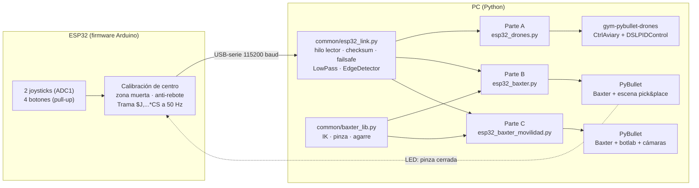

# Taller Segundo Corte — Consola de mandos con ESP32 para robots simulados en PyBullet

> Una **consola física construida con una ESP32** (2 joysticks analógicos + 4 botones) controla, a través del puerto serie, tres escenarios simulados en **PyBullet**:
>
> | Parte | Escenario | Qué se logra |
> |---|---|---|
> | **A** | Enjambre de drones (`gym-pybullet-drones`) | Mover los drones del **lugar A → B → C** |
> | **B** | Robot **Baxter** (`pybullet_robots/baxter_ik_demo.py`) | Movimiento fluido de **brazos y posicionamiento** + **coger y mover un objeto** |
> | **C** | Robot **Baxter** en un entorno de laboratorio | **Movilidad real**: la base se desplaza y los brazos se mueven a la vez, con cámaras RGB/profundidad |

---

## Tabla de contenido
1. [Arquitectura](#1-arquitectura)
2. [Hardware: la consola de mandos](#2-hardware-la-consola-de-mandos)
3. [Protocolo de comunicación ESP32 ⇄ PC](#3-protocolo-de-comunicación-esp32--pc)
4. [Estructura del repositorio](#4-estructura-del-repositorio)
5. [Paso a paso (instalación y ejecución)](#5-paso-a-paso-instalación-y-ejecución)
6. [Parte A — Drones: análisis, código y explicación](#6-parte-a--drones)
7. [Parte B — Baxter: brazos y pick & place](#7-parte-b--baxter-brazos-y-pick--place)
8. [Parte C — Baxter con movilidad](#8-parte-c--baxter-con-movilidad)
9. [Pruebas realizadas](#9-pruebas)
10. [Evidencias de funcionamiento](#10-evidencias-de-funcionamiento)
11. [Problemas frecuentes](#11-problemas-frecuentes)
12. [Cumplimiento de lo solicitado](#12-cumplimiento-de-lo-solicitado)
13. [Referencias](#13-referencias)

---

## 1. Arquitectura



**Capas y responsabilidades**

| Capa | Responsabilidad | Dónde |
|---|---|---|
| Adquisición | Leer ADC/botones, calibrar, zona muerta, anti-rebote, empaquetar y firmar tramas | `firmware/esp32_console/esp32_console.ino` |
| Enlace | Hilo lector, validación de checksum, *failsafe* (sin señal ⇒ consola neutra), emulación por teclado | `common/esp32_link.py` |
| Acondicionamiento | Filtro paso-bajo del joystick y detección de flancos de botón | `common/esp32_link.py` |
| Control | Setpoints limitados en velocidad → PID (drones) / cinemática inversa (Baxter) | `parte_*/` y `common/baxter_lib.py` |
| Simulación | Física y render en PyBullet | librerías externas |

**Decisión de diseño — por qué USB-serie:** es determinista, de baja latencia (~2 ms a 115200 baud para una trama de ~30 bytes), no requiere configurar red y la ESP32 se alimenta por el mismo cable. Como la ESP32 también tiene WiFi/Bluetooth, el protocolo es independiente del transporte: bastaría cambiar `SerialLink` por una clase UDP/TCP con el mismo método `read()`.

---

## 2. Hardware: la consola de mandos

**Materiales:** 1× ESP32 DevKit (30/38 pines), 2× módulos joystick analógico (KY-023 o similar), 4× pulsadores, 2× LED + resistencias 220 Ω, protoboard, cables y cable USB de datos.

| Elemento | Pin ESP32 | Función |
|---|---|---|
| Joystick izq. VRx / VRy | GPIO34 / GPIO35 | `lx`, `ly` |
| Joystick der. VRx / VRy | GPIO32 / GPIO33 | `rx`, `ry` |
| Alimentación joysticks | 3V3 y GND | (no usar 5 V: el ADC de la ESP32 tolera máx. 3,3 V) |
| Botón A / B / C / D | GPIO25 / 26 / 27 / 14 → GND | Pull-up interno (`INPUT_PULLUP`) |
| LED de estado (+220 Ω) | GPIO4 | Lo enciende el PC cuando la pinza está cerrada |
| LED de latido | GPIO2 (integrado) | Indica que el firmware corre |

Los ejes usan solo pines **ADC1** (32–39) porque el ADC2 se bloquea cuando se usa WiFi/Bluetooth.

---

## 3. Protocolo de comunicación ESP32 ⇄ PC

**ESP32 → PC** (50 Hz, una línea ASCII por trama):

```
$J,<lx>,<ly>,<rx>,<ry>,<btn>*<CS>\n
```

| Campo | Rango | Significado |
|---|---|---|
| `lx, ly, rx, ry` | −1000 … 1000 | Ejes de los joysticks (tras calibración, zona muerta 8 % y reescalado) |
| `btn` | 0 … 15 | Máscara de bits: bit0=A, bit1=B, bit2=C, bit3=D |
| `CS` | 00 … FF | XOR de los caracteres entre `$` y `*`, en hexadecimal |

Ejemplo: `$J,500,-1000,0,250,5*4D`.

**PC → ESP32:** `L1\n` / `L0\n` encienden/apagan el LED de estado.

**Robustez implementada**
- Tramas con checksum o formato inválido se descartan y se cuentan (`bad_frames`).
- **Failsafe:** si pasan >0,5 s sin una trama válida, `read()` devuelve la consola en neutro ⇒ los robots se detienen (por ejemplo, si se desconecta el cable).
- **Modo teclado** (`--port` omitido) para probar sin hardware.

---

## 4. Estructura del repositorio

```
Taller-Segundo-Corte/
├── README.md
├── requirements.txt
├── common/
│   ├── esp32_link.py        # protocolo, hilo serie, failsafe, filtros, teclado
│   └── baxter_lib.py        # carga de Baxter, IK por brazo, pinza, agarre (partes B y C)
├── firmware/esp32_console/
│   └── esp32_console.ino    # firmware de la ESP32
├── parte_a_drones/
│   └── esp32_drones.py
├── parte_b_baxter/
│   └── esp32_baxter.py
├── parte_c_baxter_movilidad/
│   └── esp32_baxter_movilidad.py
└── tests/
    └── test_esp32_link.py   # pruebas del protocolo y del enlace serie (sin hardware)
```

---

## 5. Paso a paso (instalación y ejecución)

### 5.1 Cargar el firmware en la ESP32
1. Instalar **Arduino IDE 2.x** y el soporte de placas **“esp32 by Espressif Systems”** (Gestor de tarjetas).
2. Abrir `firmware/esp32_console/esp32_console.ino`.
3. Seleccionar placa **ESP32 Dev Module** y el puerto (COMx en Windows, `/dev/ttyUSB0` en Linux).
4. Conectar el cableado de la sección 2, **no tocar los joysticks al encender** (se calibra el centro) y pulsar *Upload*.
5. Comprobar con el *Serial Monitor* a 115200: deben aparecer líneas `$J,0,0,0,0,0*…` y al mover un joystick cambian los valores.
6. **Cerrar el Serial Monitor** antes de ejecutar Python (el puerto solo admite un programa a la vez).

### 5.2 Preparar el entorno Python
```bash
git clone https://github.com/<tu-usuario>/Taller-Segundo-Corte.git
cd Taller-Segundo-Corte

conda create -n taller python=3.12
conda activate taller

# PyBullet (con 3.12 se compila; en Ubuntu: sudo apt install build-essential;
# en Windows: "Microsoft C++ Build Tools"; en macOS: CFLAGS="-Dfdopen=fdopen" pip install pybullet --no-cache-dir)
pip install pybullet numpy scipy pyserial

# Parte A: simulador de drones
git clone https://github.com/utiasDSL/gym-pybullet-drones.git
pip install -e gym-pybullet-drones/        # si no clona, usar https://github.com/learnsyslab/gym-pybullet-drones
```
Las partes B y C **no necesitan clonar `pybullet_robots`**: el modelo de Baxter (`baxter_common/…`), `botlab.sdf`, etc. vienen en `pybullet_data`, que se instala junto con `pybullet`. El código de `baxter_ik_demo.py` se tomó como base (ver sección 7).

### 5.3 Averiguar el puerto de la ESP32
- Windows: *Administrador de dispositivos → Puertos (COM y LPT)* → `COM5`, por ejemplo.
- Linux: `ls /dev/ttyUSB*` (puede requerir `sudo usermod -aG dialout $USER` y reiniciar sesión).
- macOS: `ls /dev/cu.usbserial*`.

### 5.4 Ejecutar cada parte
```bash
# Parte A — drones
python parte_a_drones/esp32_drones.py --port COM5

# Parte B — Baxter, brazos y pick & place
python parte_b_baxter/esp32_baxter.py --port COM5

# Parte C — Baxter con movilidad
python parte_c_baxter_movilidad/esp32_baxter_movilidad.py --port COM5
```
**Sin hardware**, omita `--port` y use el teclado (la ventana de PyBullet debe tener el foco): `W/A/S/D` = joystick izquierdo, `I/J/K/L` = joystick derecho, `1/2/3/4` = botones A/B/C/D.

Opciones útiles: `--demo` (A: recorrido automático A→B→C), `--auto` (B: pick & place automático), `--list-joints` (B: tabla de articulaciones del URDF), `--no-scene` / `--floor-z` / `--spawn X Y` (C).

---

## 6. Parte A — Drones

**Enunciado:** *Mover los drones de un lugar A a un lugar B y a un lugar C, con el control gestionado desde la ESP32.*

### 6.1 Análisis
- `gym-pybullet-drones` ofrece `CtrlAviary` (entorno que recibe **RPM de los 4 rotores** por dron) y `DSLPIDControl` (controlador PID en cascada: posición → actitud → mezclador de motores) para el dron Crazyflie `CF2X`. Tomamos de referencia `examples/pid.py`.
- La ESP32 **no calcula RPM**: define *qué* debe hacer el enjambre. Se separó así: la ESP32 elige el **destino**, el software genera un **setpoint suave**, y el PID lo sigue.
- Se usan **5 drones en formación circular** (parámetro `--num_drones`) para reflejar el escenario con varios drones; cada dron sigue `centro_formación + offset_i`, por lo que la formación se conserva en todo el trayecto y no hay colisiones.

### 6.2 Cadena de control
```
Botón A/B/C ──► destino (x,y,z)          Joystick ──► desplazamiento manual
                    │                              │
                    └──► generador de setpoint con límite de velocidad (0,6 m/s)
                                     │ centro de formación
                                     ▼
              target_i = centro + offset_i ──► DSLPIDControl ──► RPM ──► CtrlAviary (48 Hz de control, 240 Hz física)
```

### 6.3 Lugares y controles
| Lugar | Coordenadas (m) |
|---|---|
| A | (0, 0, 1) |
| B | (2, 0, 1) |
| C | (2, 2, 1) |

| Entrada | Acción |
|---|---|
| Botón **A / B / C** | El enjambre vuela suavemente al lugar A / B / C |
| Botón **D** | Aterrizar / despegar |
| Joystick izq. | Desplazar el enjambre en X/Y (cancela el “ir a”) |
| Joystick der. (eje Y) | Subir / bajar |

Al iniciar, los drones están en el suelo bajo el lugar A y **despegan automáticamente hasta A**. Flujo de prueba típico: `B` → esperar llegada → `C` → `A` → `D`.

### 6.4 Código clave (`parte_a_drones/esp32_drones.py`)
Generador de setpoint con límite de velocidad (evita escalones que desestabilizarían el PID):
```python
vec  = goal - center
dist = np.linalg.norm(vec)
step = GOTO_SPEED * dt if goal_name != "manual" else np.inf
center = goal.copy() if dist <= step else center + vec / dist * step
```
Control por dron (misma llamada que el ejemplo `pid.py`, con el setpoint de formación):
```python
for j in range(num_drones):
    action[j, :], _, _ = ctrl[j].computeControlFromState(
        control_timestep=dt, state=obs[j],
        target_pos=center + offsets[j], target_rpy=np.zeros(3))
```
El script guarda `results/trayectoria_drones.csv` (tiempo, posición media real, destino activo) para graficar y analizar el seguimiento.

**Parámetros ajustables:** `PLACES`, `GOTO_SPEED`, `MANUAL_SPEED`, `Z_MIN/Z_MAX`, `XY_LIM`, `--num_drones`.

---

## 7. Parte B — Baxter: brazos y pick & place

**Enunciado:** *Consola de mandos con la ESP32 para un movimiento fluido del robot Baxter que permita una movilidad real de brazos y posicionamiento, además de que el robot pueda coger y mover un objeto.*

### 7.1 Análisis del demo original (`baxter_ik_demo.py`)
Observaciones sobre el código de partida:
1. Controla **un solo efector** (`endEffectorId = 48`, dedo izquierdo de la pinza izquierda) con 3 *sliders* de la GUI.
2. Llama a `calculateInverseKinematics` y escribe `jointPoses[qIndex-7]` para **todas** las articulaciones (ambos brazos, cabeza, pinzas), y además hace `resetJointState` en un bucle de iteraciones: eso *teletransporta* las articulaciones (no es movimiento físico ni fluido).
3. Los límites de articulación que pasa a la IK son ficticios (`-2…2`).
4. No hay objeto, ni agarre, ni segundo brazo.

### 7.2 Qué se mejoró (`common/baxter_lib.py`)
| Problema del demo | Solución |
|---|---|
| Teletransporte con `resetJointState` | Solo `POSITION_CONTROL` con `maxVelocity = 1.5 rad/s` ⇒ el brazo se mueve físicamente y sin saltos |
| Índice mágico `qIndex-7` | Se recorre la **cadena cinemática** (padre→padre) desde el efector hasta la base; solo se comandan las articulaciones de ese brazo |
| Límites falsos | Se usan los límites reales del URDF (`ll`, `ul`, `jr`) |
| Objetivo = *sliders* | Objetivo en el **marco local del robot** que el joystick desplaza con velocidad limitada (0,35 m/s) y filtro paso-bajo ⇒ movimiento fluido |
| Solo brazo izquierdo | Ambos brazos; el botón **B** cambia el activo, el otro mantiene su pose |
| Sin objeto | Pedestal, cubo azul y placa amarilla de destino; **agarre** con constraint |

### 7.3 Posicionamiento
- Cada mano arranca en una **pose lista** equivalente al objetivo del demo `(0.2, 0, −0.1)` con la base en `(0.5, −0.8, 0)` girada 90° (`READY_LOCAL`).
- El objetivo (esfera roja) se limita a **±0,30 m** alrededor de esa pose (`WORKSPACE`) para no pedirle a la IK puntos inalcanzables.
- El botón **C** devuelve el brazo activo a su pose inicial.

### 7.4 Coger y mover un objeto
1. Mover la mano sobre el cubo y bajarla (joystick der. eje Y).
2. Botón **A** → cierra la pinza (los dedos se cierran visualmente). Si el cubo está a **< 10 cm** del efector, se crea un `JOINT_FIXED` entre el eslabón de la pinza y el cubo: **el cubo queda agarrado**. El LED de la consola se enciende.
3. Mover el brazo al cuadrado amarillo: el cubo viaja con la mano.
4. Botón **A** otra vez → se abre la pinza y se elimina el constraint: el cubo cae en el destino.
5. Botón **D** repone el cubo (si no está agarrado).

```python
# agarre (common/baxter_lib.py)
inv_p, inv_o = p.invertTransform(com_pos, com_orn)
rel_p, rel_o = p.multiplyTransforms(inv_p, inv_o, obj_pos, obj_orn)   # pose del objeto en el marco de la pinza
arm.cid = p.createConstraint(self.id, arm.ee, obj, -1, p.JOINT_FIXED, [0,0,0],
                             rel_p, [0,0,0], rel_o, [0,0,0,1])
```

### 7.5 Controles
| Entrada | Acción |
|---|---|
| Joystick izq. (X/Y) | Mano adelante/atrás e izquierda/derecha (respecto al robot) |
| Joystick der. (Y) | Mano arriba/abajo |
| Botón **A** | Cerrar/abrir pinza (agarrar/soltar) |
| Botón **B** | Cambiar brazo activo |
| Botón **C** | Brazo activo a pose inicial |
| Botón **D** | Reponer el cubo |

`python parte_b_baxter/esp32_baxter.py --auto` ejecuta una secuencia automática (sobre el cubo → bajar → agarrar → subir → transportar → soltar) e imprime la distancia final del cubo al destino; sirve para verificar la instalación sin hardware.

---

## 8. Parte C — Baxter con movilidad

**Enunciado:** *Consola de mandos con la ESP32 para un movimiento fluido del robot Baxter que permita una movilidad real.*

> **Nota sobre el enunciado:** el texto pide el robot **Baxter**, pero la captura de ese punto muestra el ExampleBrowser de Bullet con un robot Atlas en la escena de laboratorio (la de `atlas.py`). Se resolvió con **Baxter dentro de esa misma escena de laboratorio** (`botlab.sdf`) y con las vistas de cámara RGB/profundidad de la captura. Si el docente exigiera Atlas, el enlace de control (`common/esp32_link.py`) se reutiliza tal cual.

### 8.1 Análisis
En la parte B el robot es fijo. “Movilidad real” se interpretó como **desplazar el robot completo** (conducir + girar) **mientras** se mueven los brazos, con sensación suave:

- **Base**: velocidad objetivo `v = ly·0,6 m/s`, `ω = −lx·1,0 rad/s`. Se pasa por una **rampa de aceleración** (`MAX_ACC = 1,2 m/s²`, `MAX_ALPHA = 2,5 rad/s²`) y se integra la pose (x, y, yaw). Resultado: arranque y frenado sin tirones aunque el joystick cambie de golpe.
- **Brazos**: los objetivos viven en el marco local del robot, así que **viajan con la base** automáticamente; la IK los sigue.
- **Cámaras**: se activan las vistas sintéticas RGB / profundidad / segmentación del visor, y la cámara de la simulación sigue al robot.
- **Escena**: `botlab.sdf` con la conversión Y→Z de `atlas.py`. La altura del suelo se detecta con rayos (`rayTestBatch`) bajo el punto de aparición; se puede forzar con `--floor-z`.

### 8.2 Controles
| Entrada | Acción |
|---|---|
| Joystick izq. (Y) | Avanzar / retroceder |
| Joystick izq. (X) | Girar |
| Joystick der. (X / Y) | Mano izquierda-derecha / adelante-atrás |
| Botón **D** (mantener) + joystick der. (Y) | Mano arriba/abajo |
| Botón **A** | Cerrar/abrir pinza |
| Botón **B** | Cambiar brazo activo |
| Botón **C** | Brazo activo a pose inicial |

### 8.3 Código clave
```python
v = ramp(v, fr.ly * MAX_V,  MAX_ACC   * dt)     # limita la aceleración lineal
w = ramp(w, -fr.lx * MAX_W, MAX_ALPHA * dt)     # y la angular
heading = BASE_YAW0 + yaw
pos = base_pos + [cos(heading), sin(heading), 0] * v * dt
robot.set_base(pos, yaw)                        # la base es cinemática (como en el demo original)
```

---

## 9. Pruebas

Pruebas automáticas del protocolo y del enlace (no necesitan ESP32 ni simulador):
```bash
python -m unittest discover -s tests -v
```
Cubren: ida y vuelta de tramas, checksum erróneo, líneas basura, saturación de ejes, detección de flancos de botón, convergencia del filtro, y un enlace serie real sobre un pseudo-terminal con líneas inválidas y *failsafe* por pérdida de señal (esta última solo en Linux/macOS).

**Lista de verificación manual con la ESP32:**

| # | Prueba | Resultado esperado |
|---|---|---|
| 1 | Serial Monitor sin tocar joysticks | Ejes en 0 |
| 2 | Mover cada joystick a los extremos | ±1000 en su eje |
| 3 | Pulsar cada botón | `btn` = 1, 2, 4, 8 |
| 4 | Desconectar el cable con el robot en movimiento | El robot se detiene (failsafe) |
| 5 | A: `B`, `C`, `A`, `D` | Vuela a B, C, A y aterriza |
| 6 | B: cubo → destino | Cubo agarrado y soltado en la placa amarilla |
| 7 | C: conducir y girar con un brazo extendido | Movimiento continuo y sin tirones |

---

## 10. Evidencias de funcionamiento

*(Añadir aquí capturas, GIF o enlaces a video cuando se graben, por ejemplo con ``.)*

---

## 11. Problemas frecuentes

| Síntoma | Causa / solución |
|---|---|
| `could not open port` / `Access denied` | Otro programa usa el puerto (Serial Monitor o Arduino IDE). Ciérrelo. En Linux, añada su usuario al grupo `dialout`. |
| Se queda en `SIN SENAL` | Puerto equivocado, baudios distintos, o el firmware no está cargado. Verifique con el Serial Monitor. |
| Un joystick “se desplaza” solo | Se tocó al encender: reinicie la ESP32 soltándolos (se recalibra el centro). Ajuste `DEADZONE` en el firmware. |
| Un eje va invertido | Cambie el signo en `SIGN[]` del firmware. |
| `pybullet` no se instala en Python ≥ 3.11 | Instale compilador C++ (ver 5.2) o use `conda install -c conda-forge pybullet`. |
| `ModuleNotFoundError: gym_pybullet_drones` | Falta `pip install -e gym-pybullet-drones/` en el mismo entorno. |
| B/C: `No se encontro el efector…` | Ejecute `python parte_b_baxter/esp32_baxter.py --list-joints` y ajuste `EE_LEFT_DEFAULT` en `common/baxter_lib.py` al índice del dedo de la pinza izquierda. |
| B: la mano no alcanza el cubo | Ajuste `READY_LOCAL` / `WORKSPACE` en `common/baxter_lib.py` o las distancias de `build_scene()`. |
| C: Baxter aparece flotando o enterrado | Use `--floor-z <valor>` o `--spawn X Y`; `--no-scene` para probar sobre un plano. |
| Las teclas no responden (modo teclado) | Haga clic en la ventana de PyBullet para darle el foco. |

---

## 12. Cumplimiento de lo solicitado

| Requisito del taller | Dónde se cumple |
|---|---|
| Repositorio de GitHub “Taller Segundo Corte” | Este repositorio (`Taller-Segundo-Corte`; GitHub reemplaza espacios por guiones) |
| `README.md` con **arquitectura** | Sección 1 (diagrama, capas, decisiones) |
| **Análisis** del proyecto | Secciones 6.1, 7.1–7.2 y 8.1 |
| **Paso a paso** a seguir | Sección 5 |
| Códigos con su explicación | Secciones 6.4, 7.4, 8.3 y archivos comentados |
| Vídeos de funcionamiento (opcional) | Sección 10 (reservada) |
| **a)** Drones A → B → C desde la ESP32 | Parte A |
| **b)** Baxter: brazos, posicionamiento, coger y mover un objeto | Parte B |
| **c)** Baxter con movilidad real | Parte C |

---

## 13. Referencias
- Panerati et al., *gym-pybullet-drones* — https://github.com/utiasDSL/gym-pybullet-drones
- E. Coumans, *pybullet_robots* (`baxter_ik_demo.py`, `atlas.py`) — https://github.com/erwincoumans/pybullet_robots
- PyBullet Quickstart Guide — https://pybullet.org
- Espressif, *ESP32 Arduino core* y documentación del ADC — https://docs.espressif.com
